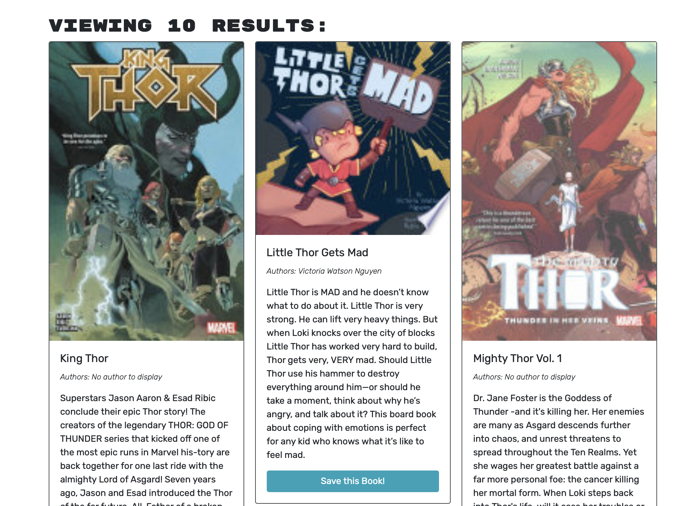

# book-search-engine

## Description

This project is creating an book searching engine by using react and graphql

## Table of Contents

- [Installation](#installation)
- [Usage](#usage)
- [Credits](#credits)
- [License](#license)
- [Tests](#tests)

## Installation

N/A

## Usage

1. Go to URL https://ben-book-searching.herokuapp.com

2. login or signup to the page

3. Type keyword to search books
   

4. Click "save this book" to save the book
   
5. Click "see your book" to check the saved books.

## Credits

BenLiu104 : https://github.com/BenLiu104

## License

License - MIT

## Tests

N/A
